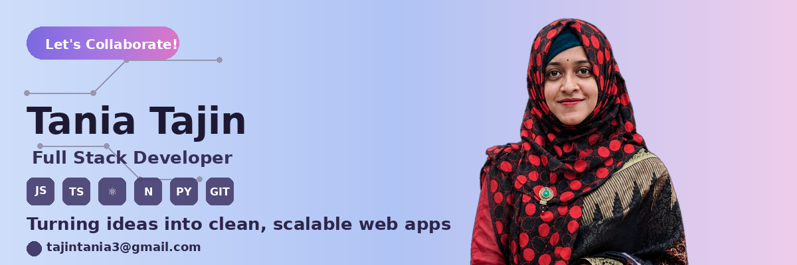

<!-- ⬇️ Banner: upload the banner image (from before) to your repo/assets or via a GitHub issue, then replace the URL below -->

<h1>Tania Tajin</h1>
<h3>Full Stack Developer</h3>

 

## 👋 About Me

আমি একজন **Full Stack Developer**, যিনি ক্লিন ও স্কেলেবল ওয়েব অ্যাপ্লিকেশন তৈরি করতে ভালোবাসি। Frontend-এ সুন্দর, ইউজার-ফ্রেন্ডলি UI ডিজাইন করা থেকে শুরু করে Backend-এ শক্তিশালী ও নিরাপদ সিস্টেম তৈরি করা — পুরো প্রসেসটাই আমার কাছে আকর্ষণীয়। নতুন টেকনোলজি শেখা এবং রিয়েল-লাইফ প্রজেক্টে সেগুলো প্রয়োগ করাই আমার প্রতিদিনের লক্ষ্য।

 

## 🚀 Currently

- 🔭 I'm working on a **Tourism Website** using the MERN stack
- 🌱 I'm exploring **Next.js** and Server-Side Rendering
- 🛠️ Improving my skills in **backend architecture & API design**
- 📚 Learning about clean code practices and scalable project structure
- 💬 Ask me about **JavaScript, React, and Frontend Design**

 

## 🧩 Skills

### Frontend

### Backend

### Tools & Others

 

## 🌐 Connect With Me

 

## 📊 GitHub Stats

 

  <i>Thanks for visiting my profile! ⭐ Feel free to connect.</i>

